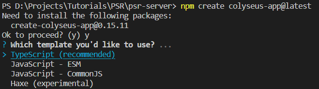
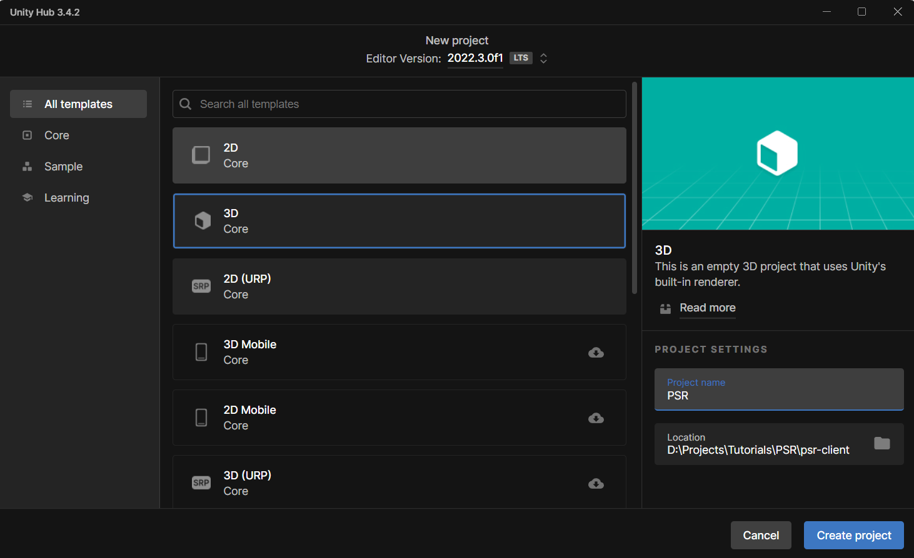
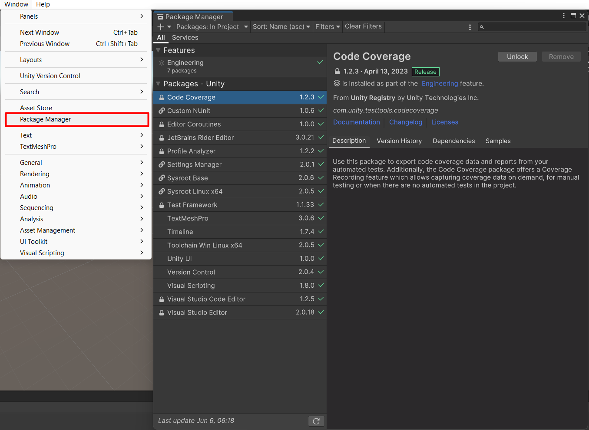
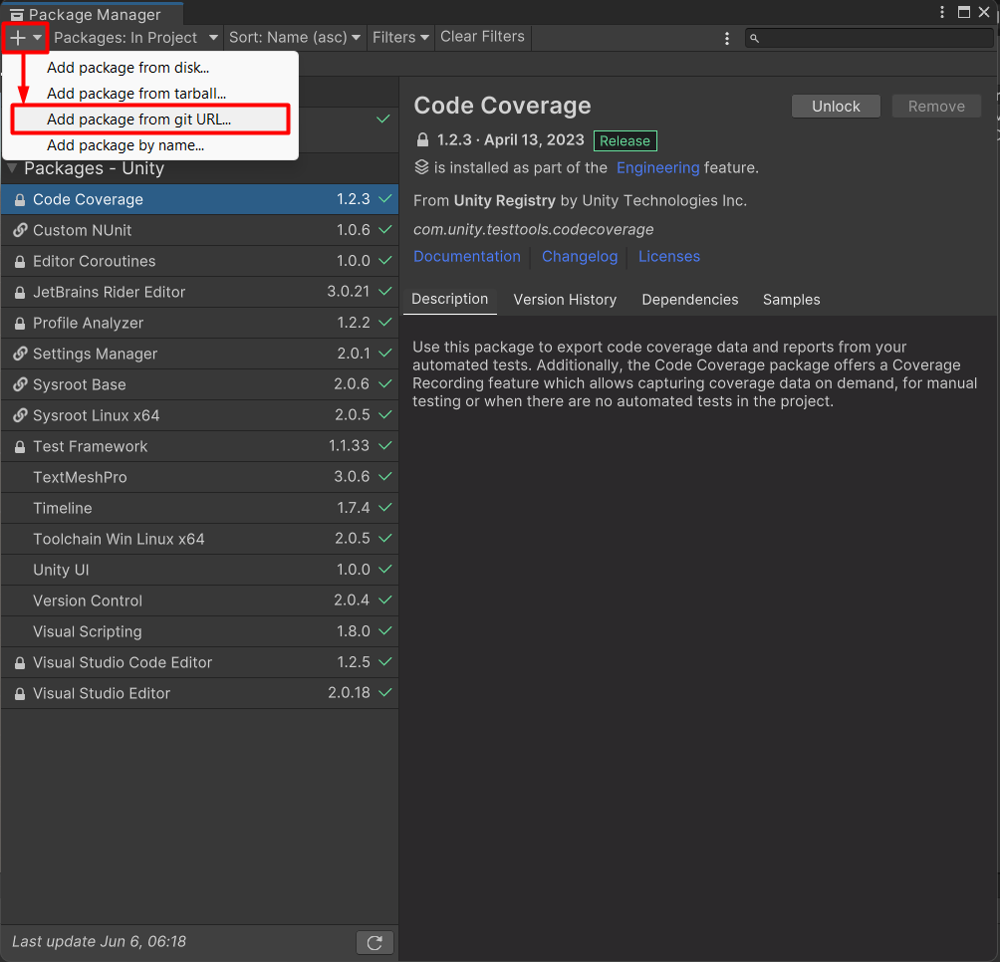
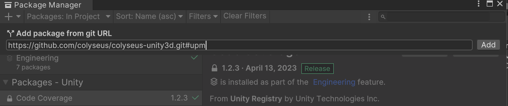
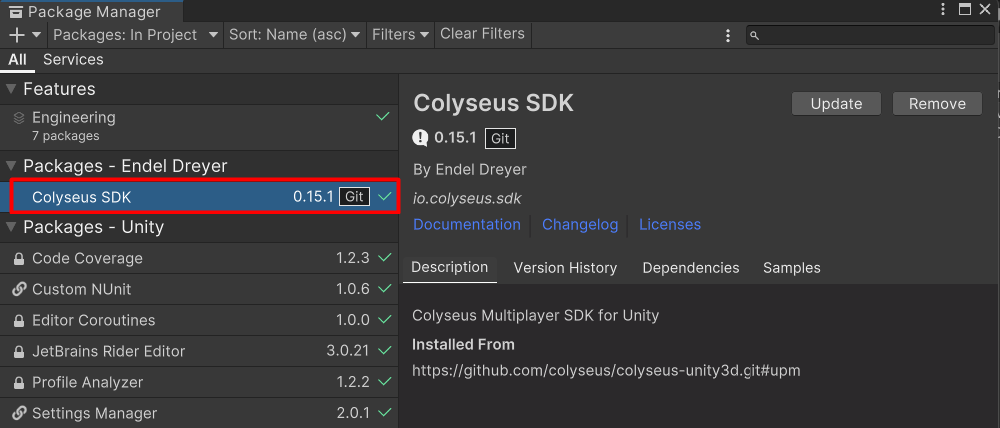
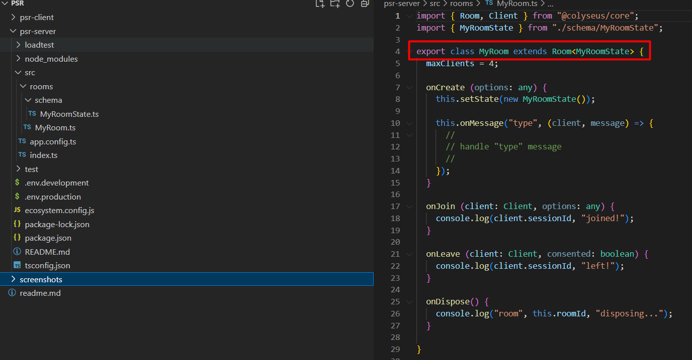
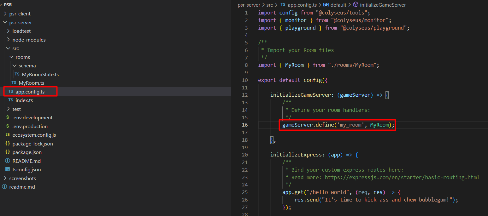
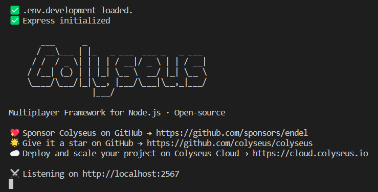

# Create server project
- Install NodeJS
- `npm create colyseus-app@latest`

# Create client project
- Install Unity
- Create Unity Project

- Unity `.gitignore`
- Unity Menu -> `Window` -> `Package Manager`

- `Package Manager` -> `+` -> `Add package from git URL...`

- `https://github.com/colyseus/colyseus-unity3d.git#upm` -> `Add`

# State and room

# Schema generate

- Create folder `{Unity Project}` -> `Assets`: `Scripts` -> `Schema`
- `cd psr-server`
- `npx schema-codegen src/rooms/schema/MyRoomState.ts --csharp --output ..\psr-client\PSR\Assets\Scripts\Schema`

# Run server

- `cd psr-server`
- `npm run start`

# Client connection & room

- `ColyseusClient client = new ColyseusClient("ws://localhost:2567");`
- `ColyseusRoom<MyRoomState> room = await client.JoinOrCreate<MyRoomState>("my_room")`