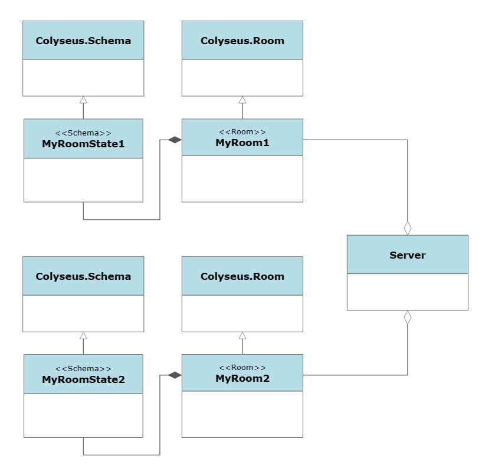
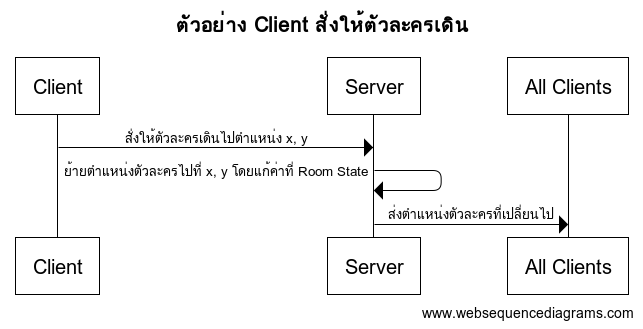
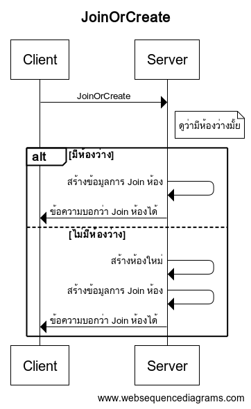
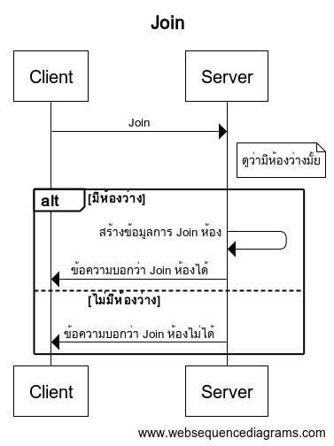
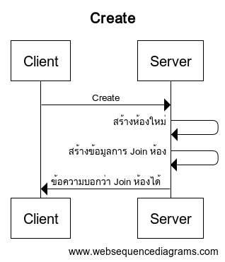

# เกี่ยวกับ Colyseus
Colyseus เป็น Networking Framework สำหรับ NodeJS, ที่มีระบบ Match Making ที่ทำให้สามารถสร้างห้อง, เข้าร่วมห้องได้. 

สามารถส่ง Message จาก Server ไปหา Client หรือ จาก Client ไปหา Server ได้โดย Function ส่ง Message ต่างๆ, สามารถส่ง Message ประเภทใดก็ได้ (แต่ตอนกำหนด Event ตอนรับข้อมูลต้องกำหนดประเภทข้อมูลให้ตรงกัน)

นอกจากการส่ง Message โดย Function ส่ง Message ต่างๆ แล้ว มันยังมีระบบ State Synchronization, สามารถกำหนด State ให้กับห้องได้, State คือข้อมูลที่ถูกจัดการโดย Server เท่านั้น เมื่อมีการเปลี่ยนแปลงจะทำการ Sync ไปให้ Client, โดยจะ Sync เฉพาะข้อมูลที่มีการเปลี่ยนแปลงเท่านั้น ทำให้ข้อมูลเล็ก/ใหญ่ตามจำนวนข้อมูลที่มีการเปลี่ยนแปลง

# สร้างโปรเจคของ Server
- ติดตั้ง [NodeJS](https://nodejs.org/)
- สร้างโปรเจคของ Server โดยใช้ cmd หรือ terminal, โดยใช้คำสั่ง `npm create colyseus-app@latest`


# สร้างโปรเจคของ Client
- ติดตั้ง [Unity](https://unity.com/)
- สร้างโปรเจคใหม่


- เปิดโปรเจคที่สร้างไว้
- ติดตั้ง Library Colyseus ของ Unity โดยใช้ Package Manager, สามารถเปิดได้จากเมนู `Window` -> `Package Manager`


- ใน `Package Manager`, กดปุ่มเมนู `+` -> `Add package from git URL...`


- ใส่ `https://github.com/colyseus/colyseus-unity3d.git#upm`, แล้วกด `Add`


# เกี่ยวกับ State Schema และ Room
- สามารถกำหนดห้องกี่ประเภทก็ได้ แต่ต้องสร้าง Class ของห้องแต่ละประเภทก่อน
- สามารถกำหนด State Schema ให้กับห้องแต่ละประเภทได้ (หรือจะไม่กำหนดก็ได้ เป็นห้องแบบที่ไม่มี State), State คือข้อมูลที่ถูกจัดการโดย Server เท่านั้น เมื่อมีการเปลี่ยนแปลงจะทำการ Sync ไปให้ Client, โดยจะ Sync เฉพาะข้อมูลที่มีการเปลี่ยนแปลงเท่านั้น ทำให้ข้อมูลเล็ก/ใหญ่ตามจำนวนข้อมูลที่มีการเปลี่ยนแปลง
- สามารถดูตัวอย่างการสร้างห้อง/กำหนดห้อง/กำหนด State Schema ได้จาก เมื่อสร้างโปรเจคแล้วจะสังเกตได้ว่ามันมี Class ชื่อ `MyRoom` มาให้, อันนี้คือ Class ของห้อง
- แล้วก็มันมีการกำหนด State Schema Class ชื่อ `MyRoomState`


- แล้วก็จะสังเกตมันมีการกำหนดห้อง โดยใช้ชื่อว่า `my_room`


- ดังนั้น Server ในตอนนี้มีห้อง แค่แบบเดียวเป็นแบบ `MyRoom` มีชื่อว่า `my_room`, ดังนั้นเวลาต่อห้องชื่อ `my_room`, กิจกรรมต่างๆ ในห้อง จะถูกจัดการโดย `MyRoom`



# การทำงานของ Room State / Schema

- เมื่อ Client เข้าห้อง Server จะส่งข้อมูล Room State ทั้งหมดไปให้ Client
- มีแค่ Server เท่านั้น ที่สามารถแก้ไขข้อมูลของ Room State / Schema ต่างๆ ได้
- Client มีหน้าที่แค่บอก Server ว่าจะทำอะไร แล้วให้ Server แก้ไขข้อมูลต่างๆ ให้
- เมื่อมีการแก้ค่าของ Room State แล้ว จะมีข้อมูลเฉพาะส่วนที่ถูกแก้เท่านั้นที่ถูกส่งไปให้ Client, ทุก Client ที่อยู่ในห้อง



# การสร้าง Schema (Generate) สำหรับ Client

- ใช้ cmd หรือ terminal เปิดเข้าไปในโฟลเดอร์โดยใช้คำสั่ง `cd colyseus-sample-server`
- ใช้คำสั่ง `npx schema-codegen src/rooms/schema/MyRoomState.ts --csharp --output ..\colyseus-sample-client\ColyseusSampleClient\Assets\Scripts\Schema` เพื่อสร้าง Schema ในโฟลเดอร์ `..\colyseus-sample-client\ColyseusSampleClient\Assets\Scripts\Schema`
- *จะสร้าง Class Schema เองก็ได้ แต่สั่งให้มัน Generate จะสะดวกกว่า*

# Server: Room Lifecycle Events

ใน Class Room แต่ละ Class เราสามารถกำหนดการทำงานใน Life Cycle Event ต่างๆ ได้ โดยจะมี Life Cycle Event หลักๆ ดังนี้

- `onCreate (options: any)`, Event นี้จะเกิดขึ้นเมื่อมีการสร้างห้อง, ค่าใน `options` คือค่าทีได้จากคำสั่งสร้างห้องต่างๆ เช่น `JoinOrCreate`, `Create` ที่ส่งมาจาก Client
- `onAuth (client: Client, options: any, request: http.IncomingMessage)` Event นี้จะเกิดขึ้นเมื่อ Client สั่ง Join ห้อง, Event นี้จะเกิดขึ้นก่อน `onJoin` เพื่อให้ Server สามารถเอาข้อมูลของ Client (`options` ที่ส่งมาตอนสั่งเข้าห้องเช่น `JoinOrCreate`, `Join` และ `Create`) ไปใช้ตัวตรวจสอบการเข้าใช้งาน, ถ้าไม่อนุญาต ให้ Throw Exception ไป เช่น `throw new ServerError(400, "Unauthorized")`, แต่ถ้าอนุญาต ให้ทำการคืนข้อมูลที่ต้องการส่งต่อไปให้ใน Event `onJoin`
- `onJoin (client: Client, options: any, auth: any)` Event นี้จะเกิดขึ้นเมื่อ Server อนุญาตให้ Client สามารถ Join ห้องได้, `options` คือค่าที่ส่งมาตอนสั่งเข้าห้องเช่น `JoinOrCreate`, `Join` และ `Create`, `auth` คือที่ได้ที่จาก Event `onAuth`, สามารถสร้างข้อมูลผู้เล่นใหม่ และเก็บไปใน Room State ได้ใน Event นี้
- `onLeave (client: Client, consented: boolean)` Event นี้จะเกิดขึ้นเมื่อ Client ออกจากห้อง, เราสามารถลบข้อมูลผู้เล่นออกจาก Room State ได้ใน Event นี้
- `onDispose ()` Event นี้จะเกิดขึ้นเมื่อห้องถูกลบออกจากระบบ, ห้องสามารถถูกลบได้เมื่อไม่มี Client อยู่ในห้องเลย

```
import http from "http";
import { Room, Client } from "colyseus";

export class MyRoom extends Room {
    // When room is initialized
    onCreate (options: any) { }

    // Authorize client based on provided options before WebSocket handshake is complete
    onAuth (client: Client, options: any, request: http.IncomingMessage) { }

    // When client successfully join the room
    onJoin (client: Client, options: any, auth: any) { }

    // When a client leaves the room
    onLeave (client: Client, consented: boolean) { }

    // Cleanup callback, called after there are no more clients in the room. (see `autoDispose`)
    onDispose () { }
}
```

# เปิด Server

- ใช้ cmd หรือ terminal เปิดเข้าไปในโฟลเดอร์โดยใช้คำสั่ง `cd colyseus-sample-server`
- ใช้คำสั่ง `npm run start` ในการเปิด Server


# การเชื่อมต่อโดย Client

- การต่อไปที่ Server จะทำได้โดยสร้าง Instance ของ Client ก่อน, โดยใช้โค้ด `ColyseusClient Client = new ColyseusClient("ws://localhost:2567");` เพื่อสร้าง Instance ที่จะต่อไปที่ Server ที่ `localhost:2567`
- สามารถเข้าห้องหรือสร้างห้องใหม่ ถ้าไม่มีห้องว่างเลย, โดย้ใช้โค้ด `ColyseusRoom<MyRoomState> Room = await client.JoinOrCreate<MyRoomState>("my_room")` เพื่อเข้าไปห้องชื่อ `my_room`
- สามารถกำหนด Options ได้ด้วย เช่น 

```
var options = new Dictionary<string, string>();
options["name"] = "DarkMasterZ";
options["job"] = "swordman";
ColyseusRoom<MyRoomState> Room = await client.JoinOrCreate<MyRoomState>("my_room", options);
```





# การส่ง Message โดย Client

- หลังจากเข้าห้องแล้วสามารถส่ง Message ไปหา Server โดยใช้โค้ด `Room.Send(type, data)`
- `type` ต้องเป็น `String` หรือ `Byte` เท่านั้น
- `data` สามารถเป็นข้อมูลประเภทไหนก็ได้
- ตัวอย่างเช่น `await Room.Send("simple-chat", "hello!!");`, จะเป็นการส่ง Message ที่มี `type` เป็น `"simple-chat"`, และ `data` เป็น `"hello!!"`

# การรับ Message ที่ส่งมาจาก Client

- ต้องกำหนดการรับ Message ตาม `type` ต่างๆ ก่อน
- สามารถกำหนดการรับ Message ได้ใน Function `onCreate`, โดยใช้ Function `onMessage` ตามตัวอย่างนี้

```
    this.onMessage("simple-chat", (client, message) => {
      console.log("Recv@Server: " + message);
    });
```

- จากตัวอย่างการกำหนดการรับ Message ด้านบน, ถ้า Client ส่ง Message โดยใช้โค้ด `await Room.Send("simple-chat", "hello!!");`, มันจะเขียน Log ที่ Server ว่า `Recv@Server: hello!!`

# การส่ง Message โดย Server

- สามารถส่ง Message ไปหา Client **ที่เฉพาะเจาะจง**ได้โดยใช้ Function `send(client, type, data, options?)`, ตัวอย่างเช่น `this.send(client, "simple-chat", "hello back");` จะเป็นการส่ง Message ที่มี `type` เป็น `"simple-chat"`, และ `data` เป็น `"hello back"` ไปหา Client
- สามารถส่ง Message ไปหา Client **ทั้งหมดในห้อง**โดยใช้ Function `broadcast(type, data, options?)`, ตัวอย่างเช่น `this.broadcast("simple-chat", "hello all");` จะเป็นการส่ง Message ที่มี `type` เป็น `"simple-chat"`, และ `data` เป็น `"hello all"` ไปหา Client ทั้งหมดที่อยู่ในห้อง
- สามารถกำหนด Client ที่ไม่ต้องการส่งได้ใน Function `broadcast(type, data, options?)` ได้ผ่าน Option ชื่อ `except`, ตัวอย่างเช่น `this.broadcast("simple-chat", "hello all", { except: client });`, `this.broadcast("simple-chat", "hello all", { except: [client1, client2, client3] });`
- `type` ต้องเป็น `String` หรือ `Byte` เท่านั้น
- `data` สามารถเป็นข้อมูลประเภทไหนก็ได้

# การรับ Message ที่ส่งมาจาก Server

- ต้องกำหนดการรับ Message ตาม `type` ต่างๆ ก่อน
- สามารถกำหนดการรับ Message ได้ในหลังจากที่เข้าห้องแล้ว, โดยใช้ Function `Room.OnMessage<TypeOfData>(type, data);` ตามตัวอย่างนี้

```
    Room.OnMessage<string>("simple-chat", (message) => {
        Debug.Log("Recv@Client: " + message)
    });
```

- จากตัวอย่างการกำหนดการรับ Message ด้านบน, ถ้า Server ส่ง Message โดยใช้โค้ด `this.send(client, "simple-chat", "hello back");`, มันจะเขียน Log ที่ Client ว่า `Recv@Client: hello back`

# การสร้าง Schema

- สร้าง Class ที่ขยาย/สืบทอด มาจาก Class `Schema`
- สร้างตัวแปรต่างๆ ที่ต้องการจะ Sync กับ Client
- ต้องกำหนด Type ของตัวแปรแต่ละตัวด้วย Type Decorator `@type()`
- พวก Primitive Type กำหนด Type โดยใช้ String
- Primitive Type Example - `string`: `@type("string") stringVar : string`
- Primitive Type Example - `boolean`: `@type("boolean") booleanVar : boolean`
- Primitive Type Example - `int32`: `@type("int32") intVar : number`
- Primitive Type Example - `int64`: `@type("int64") longVar : number`
- Primitive Type Example - `float32`: `@type("float32") floatVar : number`
- Primitive Type Example - `float64`: `@type("float64") doubleVar : number`
- ถ้าอยากสร้าง Class ใหม่เอามาใช้ใน Schema, Class ใหม่อันนั้น ก็จะต้องขยาย/สืบทอด มาจาก Class `Schema` เหมือนกัน, การกำหนดตัวแปรต่างๆ ก็ทำเหมือนกัน, แต่การจะเอาไปใช้ในอีก Schema นึงนั้นมีวิธีกำหนด Type ต่างกันนิดหน่อย คือใช้ `@type()` เหมือนกัน แต่ไม่ได้กำหนดโดยใช้ String แล้วกำหนดโดยเอาชื่อตัวแปรนั้นมาใส่เลย เช่น:
```
class CustomSchema extends Schema {
    @type("number") width: number;
    @type("number") height: number;
}

class RoomState extends Schema {
    @type(CustomSchema) customSchema: CustomSchema = new CustomSchema();
}
```
- ถ้าจะใช้ Array ตัวแปรต้องเป็น `ArraySchema` และ ต้องกำหนด Type เป็น `[<ประเภทตัวแปร>]`, เช่น `@type([ "string" ]) stringArray = new ArraySchema<string>();`, `@type([ CustomSchema ]) customSchemas = new ArraySchema<CustomSchema>();`
- ถ้าจะใช้ Map/Dictionary ตัวแปรต้องเป็น `MapSchema` และ ต้องกำหนด Type เป็น `{map:<ประเภทตัวแปร>}`, เช่น `@type({ map: CustomSchema }) customSchemas = new MapSchema<CustomSchema>();`, ไม่สามารถกำหนด Type ของ Key ได้ ทุก Map ใช้ Key เป็น String
- ยังมี `SetSchema` กับ `CollectionSchema` อีกตัวด้วย แต่ใช้กับ C# ไม่ได้, ข้ามไป